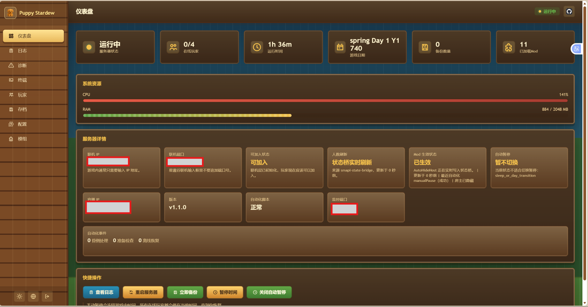
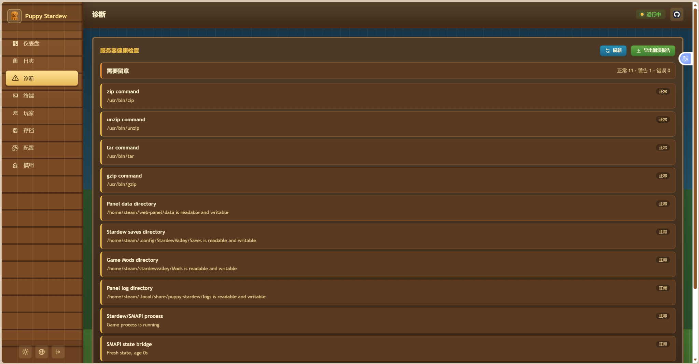
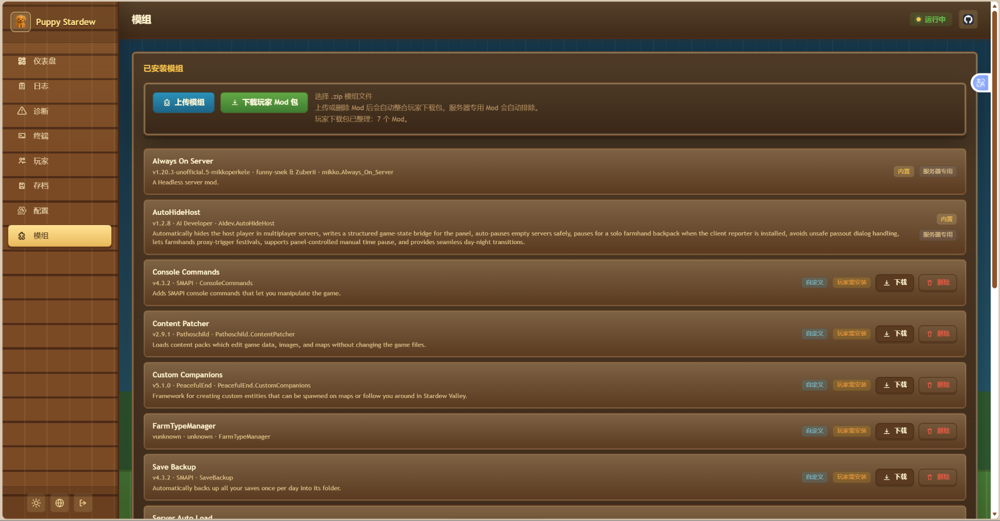
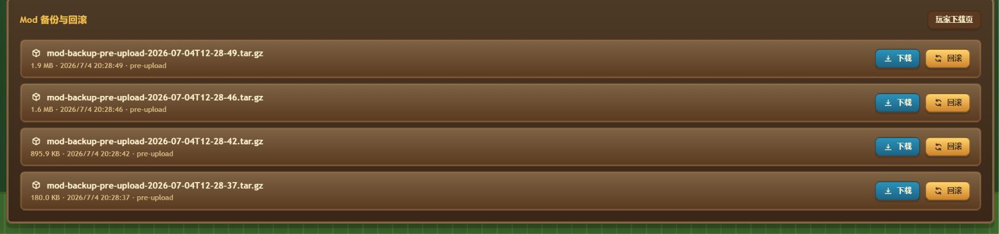

# ylty 的星露谷联机面板

一个面向《星露谷物语》联机房主的 Docker 服务器与 Web 管理面板。它会在容器中运行真实的 Stardew Valley + SMAPI 游戏进程，让这台容器扮演联机主机，并提供网页面板来管理状态、日志、存档、备份、模组和常见错误诊断。

这个项目适合想要长期开放同一个农场、让朋友随时进入联机世界的玩家。需要注意的是，星露谷本身没有真正的 dedicated server，所谓“服务器”仍然是一个被自动隐藏和自动化操作的主机玩家。本项目已加入节日代理触发和大型内容 Mod 玩家事件代理，但遇到 Steam Guard、首次载入、模组异常菜单等特殊场景时，仍可能需要人工处理。

## 主要功能

- Docker Compose 一键部署星露谷联机主机
- ServerAutoLoad v2 通过原生 `Co-op -> Host` 流程自动载入存档，避免普通读档导致 farmhand 席位初始化不完整
- Web 面板查看服务器状态、联机 IP、在线人数、CPU/内存、游戏日期
- Web 面板内置一键更新按钮，可自动备份关键配置、拉取最新版并重建 Docker 服务
- Web 面板内置更新日志页面，可直接查看每个版本新增、优化和修复内容
- Web 面板内置一键卸载项目按钮，只移除本项目容器、项目本地镜像和项目目录，不卸载 Docker
- 默认按 8 人联机上限显示和写入游戏启动偏好，可通过 `MAX_PLAYERS` 调整
- 显式编排状态机，区分 `INIT`、`VERIFYING`、`LOADING`、`STABILIZING`、`RUNNING`、`DEGRADED`、`STOPPED`
- `save + mod_graph + SMAPI` 世界指纹，能持续提示存档、Mod 或 SMAPI 组合是否发生变化
- 自动生成 `mod_graph.json`，检查 Mod 依赖缺失、重复 UniqueID 和 manifest 解析错误
- SMAPI 状态桥输出 `game-state.json`，面板可区分“游戏运行”和“联机可加入”
- 星露谷风格主题界面，支持亮色/暗色模式
- 日志页支持错误筛选、诊断卡片和准确错误原因提示
- 仪表盘实时监控游戏时间是否暂停，并显示手动暂停、自动空服暂停、单人背包暂停等来源
- 真正可用的自动空服暂停：无人在线后延迟冻结游戏时间，玩家连入时自动恢复
- 单个真实玩家打开背包时自动暂停游戏时间（房主不计入人数，需要玩家安装本地上报 Mod）
- 手动暂停/恢复游戏内时间，适合临时等人、查在线人数或处理联机状态
- 任意在线玩家进入节日地点时，可由服务器房主自动代理触发节日
- 大型内容 Mod 玩家事件代理，真实玩家进图时由隐藏房主自动检查房主侧解锁剧情
- 存档上传、默认存档选择、备份下载和手动备份
- 模组列表查看、上传自定义模组、删除自定义模组，并可一键下载玩家本地 Mod 包
- 手机端适配优化，底部导航、按钮、状态标签和 Mod 卡片会在窄屏下自动重排
- SMAPI 控制台入口，可输入 Steam Guard 验证码或 SMAPI 命令
- 自动备份、崩溃重启、日志分类、Prometheus 指标

## 界面截图

### 仪表盘：服务器状态与联机信息



仪表盘用于查看服务器是否运行、真实在线玩家人数、运行时间、游戏日期、CPU/RAM 占用、联机 IP、可加入状态、Mod 生效状态、自动暂停状态和当前暂停来源。常用操作也集中在这里，包括查看日志、重启服务器、立即备份、暂停/恢复游戏内时间、开关自动暂停和检查玩家 Mod 包。

### 诊断：服务器健康检查与崩溃报告



诊断页会检查 `zip`、`unzip`、`tar`、`gzip` 命令、面板数据目录、存档目录、Mod 目录、日志目录、SMAPI 进程、状态桥和最近日志诊断。遇到崩溃或玩家无法连接时，可以导出崩溃报告，里面会包含关键环境信息和准确报错线索，方便排查原因。页面也提供 `一键安全修复`，可自动补齐常见目录、修复可写权限并重建玩家 Mod 下载包；无法自动处理的问题会继续显示明确原因。

### 模组管理：上传、下载与玩家 Mod 包



模组页用于查看内置 Mod 和自定义 Mod，支持上传单个 Mod zip 或多个 Mod 组合包、删除自定义 Mod、刷新 Mod 列表、生成玩家本地需要安装的 Mod 下载包，并在每个需要玩家安装的 Mod 后面提供单独下载按钮。页面会区分服务器专用 Mod 和玩家需要安装的 Mod，避免玩家误装服务端组件。

组合包上传后，面板会先在服务器临时目录解压，扫描压缩包内每个 `manifest.json`，再把多个 Mod 文件夹安装到游戏 `Mods` 目录。若组合包中的某些 Mod 已存在，面板会列出冲突文件夹，确认覆盖后先创建安全备份再替换。

模组页会直接提示大量 Mod 的推荐打包方式：把多个 Mod 文件夹放进一个 zip，每个 Mod 文件夹内都保留自己的 `manifest.json`，然后一次上传这个组合包。

### Mod 备份与回滚：降低误删和更新风险



Mod 备份区会在覆盖、删除、清空或回滚 Mod 前自动创建快照，管理员可以下载备份或一键回滚。新上传且没有冲突的 Mod 不会额外复制整套 Mod 目录，减少 2 核 2G 服务器的磁盘和 CPU 压力；如果某个 Mod 更新后导致服务器无法进入，可以使用覆盖前或删除前的备份快速恢复。

## 玩家 Mod 包

如果你在面板里上传了内容类或客户端也需要安装的 SMAPI Mod，玩家本地没有对应 Mod 时，可能会出现无法进入、内容缺失、报错或多人状态不一致的问题。面板上传单个 Mod 或多个 Mod 组合包后，会自动整合玩家下载包，并生成 `stardew-client-mods.zip`。

内置的服务器控制 Mod（例如 AutoHideHost、ServerAutoLoad、Always On Server、Skill Level Guard）会被自动排除，不需要玩家单独安装。

单人背包暂停需要玩家本地安装内置的 `ylty Single Player Pause Reporter`。它会被自动放进“下载玩家 Mod 包”里，只负责上报玩家是否打开背包，不修改玩家存档。

玩家只需要在面板“模组”页面点击“下载玩家 Mod 包”，解压后把里面的 Mod 文件夹放进自己本地的 Stardew Valley `Mods` 目录。下载接口会优先使用已自动整理好的缓存包；如果缓存包缺失或过期，会在下载时自动重建。

如果玩家只想下载某一个上传的 Mod，可以在“模组”列表里点击对应 Mod 后面的“下载”按钮。内置服务器 Mod 不会显示单独下载按钮，避免玩家误装服务端专用组件。

玩家也可以直接打开公开下载页：

```text
http://你的面板地址:18642/player-mods
```

这个页面不需要管理员登录，只能下载玩家 Mod 包、单个玩家必需 Mod 和查看 `mod-manifest.json` 校验清单。清单会显示每个 Mod 的名称、版本、文件大小、更新时间和 SHA256，方便玩家核对本地安装是否一致。

## Mod 备份、回滚与诊断

面板在覆盖、删除、清空或回滚 Mod 前会自动创建一份 Mod 快照，包含上传源目录和游戏 `Mods` 目录。管理员可以在“模组”页面查看、下载或回滚这些备份。回滚前面板会再次创建一份 `pre-rollback` 安全备份，避免误操作后没有退路。

“诊断”页面会检查 `zip`、`unzip`、`tar`、`gzip`、目录权限、SMAPI 状态桥、联机可加入状态和最近日志诊断。遇到崩溃时可以点击“导出崩溃报告”，报告会打包健康检查、Mod 校验清单、SMAPI 日志、状态桥和暂停控制文件，方便排查问题。点击“一键安全修复”会执行低风险修复：创建缺失目录、尝试修复目录可写权限、重建玩家 Mod 包并刷新公共 Mod 清单。

## 架构 V2 状态模型

新版会把面板运行状态拆成明确的元数据文件，默认写在 `data/meta/`：

- `orchestration-state.json`：启动脚本写入当前阶段，例如校验 Steam 凭证、下载游戏、安装 SMAPI、同步 Mod、启动显示环境和启动游戏。
- `mod_graph.json`：面板根据已安装 Mod 的 `manifest.json` 生成依赖图，记录版本、依赖、缺失依赖、重复 ID 和解析错误。
- `world_fingerprint.json`：把当前选中存档、Mod 依赖图和 SMAPI 版本合成世界指纹。第一次生成会成为基线；后续如果存档、Mod 或 SMAPI 组合变化，仪表盘和诊断页会持续提示“世界指纹变化”，直到管理员确认备份和兼容性后在仪表盘点击“接受基线”。

默认 `PANEL_WORLD_HASH_MODE=manifest` 只锁定 manifest、版本和依赖关系，适合 2 核 2G 小服务器；如果你要做完整目录级校验，可以在 `.env` 中设置 `PANEL_WORLD_HASH_MODE=full`，但大型 Mod 多时会明显增加读盘和 CPU 压力。

## 自动空服暂停

内置 AutoHideHost 会读取真实在线玩家数，不统计隐藏房主。默认策略是：

- 存档和多人联机层就绪后，先等待 45 秒启动保护
- 服务器无人在线持续 30 秒后，自动设置 `Game1.paused = true`
- 任意玩家开始连入时立即恢复游戏时间
- 管理员手动暂停优先，自动暂停不会覆盖手动暂停
- 保存、过夜、事件、菜单等不适合切换暂停的状态下，会暂缓操作

仪表盘提供“开启自动暂停 / 关闭自动暂停”按钮，会实时写入运行时控制文件，无需重启容器：

```text
/home/steam/web-panel/data/auto-pause.json
```

可在 `Mods/AutoHideHost/config.json` 中调整：

```json
{
  "PauseWhenEmpty": true,
  "AutoPauseControlFile": "/home/steam/web-panel/data/auto-pause.json",
  "EmptyPauseDelaySeconds": 30,
  "AutoPauseStartupGraceSeconds": 45,
  "AutoResumeOnPlayerJoin": true,
  "AutoPausePollTicks": 60
}
```

SMAPI 控制台命令：

```text
autohide_auto_pause status
autohide_auto_pause on
autohide_auto_pause off
```

仪表盘的“自动暂停”状态会显示当前是等待空服、已自动暂停、有人在线，还是被保存/事件/菜单等状态阻止。

## 手动暂停游戏时间

面板的仪表盘里有“暂停时间 / 恢复时间”按钮。

开启后，面板会写入：

```text
/home/steam/web-panel/data/manual-pause.json
```

内置 AutoHideHost 模组会读取这个状态文件，并在游戏内强制设置 `Game1.paused`，从而冻结游戏时间。关闭后，模组会解除由面板触发的暂停。

这个功能用于：

- 等朋友加入时先暂停游戏时间
- 在线人数刷新或排查联机状态时避免游戏继续走时间
- 临时离开电脑但不想让游戏内时间继续推进

也可以在 SMAPI 控制台中使用：

```text
autohide_pause_time on
autohide_pause_time off
autohide_pause_time toggle
autohide_pause_time status
```

## 单人背包自动暂停

当真实在线玩家数正好为 1 时，玩家打开背包菜单会自动冻结游戏时间；关闭背包后恢复。这里的“玩家”不包含隐藏房主。

这个功能需要该玩家本地安装 `ylty Single Player Pause Reporter`，因为远程玩家的背包菜单是客户端本地 UI，服务器不能凭空知道。面板“模组”页面下载的玩家 Mod 包会包含这个上报 Mod。

服务端可在 `Mods/AutoHideHost/config.json` 中调整：

```json
{
  "PauseWhenSingleFarmhandOpensMenu": true,
  "SingleFarmhandMenuPauseTimeoutSeconds": 10
}
```

如果有 0 个真实玩家、2 个及以上真实玩家、玩家没安装上报 Mod、正在保存/过夜/事件中，服务器不会触发这个暂停。

## 任意玩家触发节日

节日当天在开放时间内，任意在线玩家进入当天节日地点时，AutoHideHost 会让服务器端隐藏房主自动进入同一节日地点并启动节日事件。这样不需要专门打开 VNC 去操作服务器房主，普通玩家也能发起节日流程。

这个功能默认开启，不需要其他玩家安装客户端模组。可在 `Mods/AutoHideHost/config.json` 中调整：

```json
{
  "EnableFestivalProxyTrigger": true,
  "FestivalProxyCooldownSeconds": 20
}
```

状态桥 `game-state.json` 会输出当天节日 ID、地点、开放时间和最近一次代理触发记录，方便在面板或日志里排查。

## 大型内容 Mod 剧情代理

Ridgeside Village（里村）、Stardew Valley Expanded、East Scarp 等大型内容 Mod 通常会同时包含“静态内容”和“事件解锁”。地图、新道路、新 NPC 能出现，只能说明服务器和玩家本地都加载了内容包；能不能触发剧情，还取决于主机存档状态、`eventsSeen`、邮件/全局标记、当前地点、时间和触发玩家。

这个项目运行的是一个真实的隐藏房主客户端，不是真正的无头专用服。旧版本为了隐藏房主，会把房主长期移到安全位置；这会导致部分大型 Mod 的“房主侧前置/介绍/解锁事件”没有机会自然检测，所以玩家能看到地图，却进不去需要事件解锁的区域。

AutoHideHost v1.4.0 起新增“玩家事件代理”：任意真实玩家进入一个地点时，隐藏房主会临时进入同一地点和同一坐标，先让 Stardew/SMAPI 正常检查房主侧事件；如果触发了事件，AutoHideHost 会等待并在安全时推进/跳过，然后重新隐藏房主。这样大型 Mod 的主机侧解锁链不再要求服主每次打开远程画面干预。

遇到“大型 Mod 装了但剧情不触发”时，按这个流程排查：

1. 确认服务器端和所有玩家本地 Mod 版本一致，缺依赖时先补齐依赖并重启服务器。
2. 打开 Web 面板的“诊断”页面，看“大型内容 Mod 剧情兼容”是否提示缺失依赖、旧版 AutoHideHost、菜单阻塞、事件阻塞或事件代理失败原因。
3. 让任意真实玩家离开并重新进入大型 Mod 的目标触发地点。
4. 在仪表盘查看“玩家事件代理”，确认它是否显示“代理进图 / 检查事件 / 事件进行中 / 已完成”。
5. 如果上次代理失败，按面板给出的具体原因处理，例如正在保存、菜单打开、已有事件占用或代理超时。

面板按钮不会再直接写入 `/proc/<SMAPI_PID>/fd/0`，而是写入：

```text
/home/steam/web-panel/data/host-command.json
```

AutoHideHost 会在游戏主线程读取这个命令文件并回写执行结果到 `game-state.json`。这样可以避开部分服务器上 `/proc/.../fd/0` 权限拒绝导致的 `EACCES: permission denied`。

更新后的容器启动时会自动检查内置服务端 Mod 的 `manifest.json` 版本。如果 `data/game/Mods/AutoHideHost` 里还是旧版，启动脚本会先备份旧目录到 `/home/steam/web-panel/data/preinstalled-mod-backups/`，再替换为镜像内置的新版本；玩家自己上传的其他 Mod 不会被这个流程覆盖。

也可以在 SMAPI 控制台手动执行：

```text
autohide_expansion_mode start
autohide_expansion_mode finish
autohide_expansion_mode status
```

说明：事件代理不是硬改大型 Mod 的剧情条件，它只是让隐藏房主在正确地点自然参与一次事件检测。不同大型 Mod 对“谁触发、是否需要房主存档状态、是否需要玩家本地安装内容包”的要求仍然不同；面板会尽量减少隐藏房主带来的阻塞，并把代理状态、上次触发地点和失败原因报告出来。

## 晕倒处理安全策略

旧版脚本会在日志出现 `passed out`、`exhausted` 或 `collapsed` 时直接对游戏窗口发送按键。新版默认关闭这类按键自动处理，避免把玩家野外晕倒或体力耗尽误判成凌晨 2 点过夜流程。

如果确实需要键盘兜底，可以在 `.env` 中显式开启：

```env
ENABLE_PASSOUT_KEY_AUTOMATION=true
```

开启后脚本也会先读取 `game-state.json`，只有确认处于凌晨 2 点、保存或过夜流程时才会发送少量确认键。

## 可加入状态

AutoHideHost 会定期写入：

```text
/home/steam/web-panel/data/game-state.json
```

Web 面板会优先读取这个 SMAPI 状态桥，而不是只靠日志推断。仪表盘里的“可加入状态”会区分：

- 游戏进程是否运行
- 存档是否已加载
- 当前客户端是否为主机服务器
- 多人联机层是否初始化
- 是否正在保存、卡菜单或卡事件

ServerAutoLoad v2 会在启动时自动打开星露谷原生 `Co-op -> Host` 存档槽位来载入目标存档，而不是普通读档后再补主机模式。这样多人联机层、可用 farmhand 列表和席位上限会按游戏原流程初始化。若仍然不可加入，面板会显示 `server-autoload-state.json` 阶段和“加入握手”阶段，用于区分是 Host 页加载、席位列表、客户端选择 farmhand 还是批准加入失败。

## 快速开始

一行安装：

```bash
curl -fsSL https://gh.sixyin.com/https://github.com/ylty1516/puppy-stardew-server-updated/releases/latest/download/install.sh | bash
```

脚本会优先下载 GitHub Release 里的项目压缩包，支持 `.tar.gz` 和 `.zip` 两种 release 资产；失败时再回退到 main 分支源码压缩包和浅克隆。它会自动生成 `.env`、初始化 `data/saves`、`data/game`、`data/meta`、`data/secrets` 等目录权限，并询问是否立即启动 Docker 服务。

如果代理不可用，可以使用 GitHub 原地址：

```bash
curl -fsSL https://github.com/ylty1516/puppy-stardew-server-updated/releases/latest/download/install.sh | bash
```

如果你已经手动克隆了仓库，也可以在项目目录里运行：

```bash
bash install.sh
```

手动安装方式仍然可用。首次启动前先复制环境变量文件：

```bash
cp .env.example .env
```

然后编辑 `.env`，至少填写：

```env
STEAM_USERNAME=你的Steam账号
STEAM_PASSWORD=你的Steam密码
```

然后初始化目录权限并启动：

```bash
./init.sh
docker compose up -d --build
```

面板默认地址：

```text
http://你的服务器IP:18642
```

游戏联机端口：

```text
24642/udp
```

装完后建议立刻做一次验收：

```bash
docker compose ps
./health-check.sh
./verify-deployment.sh
```

其中 `health-check.sh` 会检查游戏容器、Web 面板、SMAPI 状态桥、在线可加入状态、管理容器、V2 元数据目录和端口映射；`verify-deployment.sh` 更适合出问题时复制结果给维护者排查。

## 更新面板

新版面板可以直接在网页里更新：进入 `配置` 页面，点击 `面板一键更新`。更新任务会由 `stardew-manager` 管理容器启动独立 updater 容器执行，流程包括备份 `.env`、`docker-compose.yml`、启动偏好和存档，拉取 GitHub 最新代码，然后 `docker compose up -d --build --remove-orphans` 重建服务。`data/`、`secrets/` 和玩家上传内容会保留。

如果更新一直停在“排队中”，新版会在超时后自动标记为失败，并在面板里显示 updater 容器日志尾部。正常情况下排队阶段只应该很短；如果失败，请优先检查 `stardew-manager` 容器是否运行、Docker socket 是否挂载、项目目录是否有写入权限。

如果页面显示 `HTTP 502` 或“管理容器不可达”，说明 Web 面板没有连上 `stardew-manager`，不是游戏 Mod 的问题。先在服务器项目目录执行：

```bash
docker ps | grep puppy-stardew-manager
docker logs puppy-stardew-manager --tail=80
docker compose up -d --build stardew-manager stardew-server
```

如果你已经装的是旧版，还没有看到这个按钮，需要先在服务器项目目录里手动更新一次：

```bash
git pull
docker compose up -d --build
```

如果旧版面板还没有 Web 一键更新按钮，或者想直接安全重装/修复安装，可以复制这一行运行：

```bash
(curl -fsSL https://gh.sixyin.com/https://raw.githubusercontent.com/ylty1516/puppy-stardew-server-updated/main/update.sh || curl -fsSL https://raw.githubusercontent.com/ylty1516/puppy-stardew-server-updated/main/update.sh) | bash
```

这条命令会下载最新版更新脚本，自动备份 `.env`、`docker-compose.yml`、启动偏好和存档，然后拉取最新代码并重建 Docker 服务。存档备份会排除运行时 `ErrorLogs/SMAPI-latest.txt`，避免正在写入的 SMAPI 日志把更新误判为失败；`data/`、`secrets/` 和玩家上传内容会保留，不会当成全新安装直接清空。

如果项目目录不在默认位置，先进入项目目录再执行：

```bash
cd /你的项目目录 && (curl -fsSL https://gh.sixyin.com/https://raw.githubusercontent.com/ylty1516/puppy-stardew-server-updated/main/update.sh || curl -fsSL https://raw.githubusercontent.com/ylty1516/puppy-stardew-server-updated/main/update.sh) | bash
```

完成这次以后，后续更新就可以直接在 Web 面板里点按钮，不用再进 SSH。

## Web 面板危险操作

`模组` 页面提供 `清空上传Mod` 按钮。它会删除 `data/custom-mods/` 里的全部上传文件和 `data/game/Mods/` 里的非内置自定义 Mod，并自动重建玩家 Mod 下载包；`AutoHideHost`、`ServerAutoLoad`、`AlwaysOnServer`、`SkillLevelGuard` 等内置服务端 Mod 会保留。执行前会创建 Mod 回滚备份，重启服务器后完全生效。

`配置` 页面提供 `出厂化重置游戏` 按钮。它会要求输入 `RESET` 确认，然后由 `stardew-manager` 启动独立任务执行：备份存档、上传 Mod、`data/meta` 和关键配置，停止游戏容器，清空 `data/saves`、`data/game`、`data/custom-mods`、`data/logs`、`data/meta`、玩家 Mod 下载包和运行控制文件，再重新创建服务器。

出厂化重置会保留项目源码、`.env`、面板登录数据、`data/steam`、`data/backups` 和 `data/secrets/`。因为 `data/game` 会被清空，下一次启动会重新下载/校验 Stardew Valley 并安装内置 Mod，耗时取决于服务器网络和 Steam 下载速度。

`配置` 页面也提供 `卸载项目` 按钮。它会要求输入 `UNINSTALL` 确认，然后停止并移除本项目的 Docker Compose 服务、固定容器、本地项目镜像和项目目录。它不会执行 `docker system prune`，不会卸载 Docker，也不会删除服务器上的其他项目。

如果面板已经打不开，也可以在服务器 SSH 中进入项目目录执行：

```bash
PUPPY_UNINSTALL_CONFIRM=UNINSTALL ./uninstall.sh
```

如果你只想停止并清理容器、暂时保留项目文件，可以执行：

```bash
PUPPY_UNINSTALL_CONFIRM=UNINSTALL PUPPY_UNINSTALL_KEEP_FILES=true ./uninstall.sh
```

## 2核2G 小服务器优化

这个项目运行的是真实 Stardew Valley + SMAPI 客户端，所以主要资源占用来自游戏本体、Xvfb/VNC、Steam 和已安装 Mod。面板这边已经按 2核2G 做了轻量默认值：状态接口 5 秒缓存、在线人数仍按 20 秒刷新、世界状态 60 秒缓存、默认只做 Mod manifest 级指纹、日志只读尾部、Mod 公共清单 2 分钟缓存、Mod 组合包解压 120 秒超时、健康检查命令 1.5 秒超时，并限制内存里的历史记录长度。

Web 面板的 `配置` 页面新增 `服务器配置推荐` 卡片。它会手动检测当前容器可用 CPU、内存、数据盘剩余空间和已安装 Mod 压力，并按 `极低配置`、`2核2G 标准档`、`2核2G 大型Mod压力档`、`4核4G`、`高配置档` 给出推荐。

推荐卡片不会自动改服务器配置。你可以点击 `应用到表单`，它只会把推荐值填入配置页表单；确认无误后再点 `保存更改`，最后重启 Docker 容器生效。也可以点击 `复制 .env`，把推荐项复制出来手动写入 `.env`。

如果你的服务器压力比较大，建议在 `.env` 中启用或确认这些配置：

```env
LOW_PERF_MODE=true
TARGET_FPS=30
ENABLE_VNC=false
ENABLE_LOG_MONITOR=true
PANEL_STATUS_CACHE_MS=5000
PANEL_STATUS_HISTORY_LIMIT=180
PANEL_STATUS_LOG_TAIL_BYTES=131072
PANEL_PLAYER_HISTORY_LIMIT=144
PANEL_PLAYER_LOG_TAIL_BYTES=131072
PANEL_LOG_TAIL_BYTES=524288
PANEL_LOG_DEFAULT_LINES=200
PANEL_LOG_MAX_LINES=600
PANEL_PUBLIC_MOD_MANIFEST_CACHE_MS=120000
PANEL_DIAGNOSTIC_LOG_TAIL_BYTES=262144
PANEL_HEALTH_COMMAND_TIMEOUT_MS=1500
PANEL_COMMAND_TIMEOUT_MS=1500
```

说明：

- `ENABLE_VNC=false` 适合存档已经创建好、平时不需要远程画面的服务器，可减少一部分内存占用；需要首次设置、Steam Guard 或手动进游戏时再临时打开。
- `LOW_PERF_MODE=true` 和 `TARGET_FPS=30` 会降低画面渲染压力，更适合 2核2G。
- `PANEL_*_TAIL_BYTES` 控制面板读取日志尾部的大小，避免每次刷新都扫完整大日志。
- `PANEL_WORLD_HASH_MODE=manifest` 避免频繁遍历大型 Mod 目录；只有排查文件级不一致时才建议临时改成 `full`。
- `PANEL_PUBLIC_MOD_MANIFEST_CACHE_MS` 控制玩家 Mod 校验清单缓存时间，避免公开下载页频繁重新计算 SHA256。
- 这些配置只影响 Web 面板和辅助脚本，不会把游戏服务器变成空壳；玩家连接仍然依赖真实 SMAPI 游戏进程。

## 常用端口

| 端口 | 用途 |
| --- | --- |
| `18642/tcp` | Web 管理面板 |
| `24642/udp` | 星露谷联机端口 |
| `5900/tcp` | VNC 画面 |
| `9090/tcp` | Prometheus 指标 |

## 面板功能

### 仪表盘

显示游戏进程状态、在线玩家数、运行时间、游戏日期、联机地址、备份数量、已加载模组和自动化事件。这里也提供“查看日志”“重启服务器”“立即备份”“更新面板”“暂停时间”“自动暂停”等快捷操作。

### 日志诊断

日志页会对常见问题给出原因和建议，例如：

- Steam Guard 等待验证码
- Steam 登录失败或账号未拥有游戏
- SteamCMD 下载失败
- 磁盘空间不足
- 目录权限错误
- 存档无法加载
- 模组异常
- VNC 启动失败
- 备份失败

### 存档管理

支持上传星露谷存档 zip、设置默认自动载入存档、创建备份、下载备份和查看备份状态。备份下载通过认证请求获取文件，不会把长期登录 token 拼进下载链接；创建备份前会读取 SMAPI 状态桥，游戏正在保存时会阻止备份并提示稍后重试。

### 模组管理

可以查看内置模组和上传的自定义模组。上传 zip 后会尝试自动安装到游戏 `Mods` 目录，重启后生效。

## 重要说明

这个项目不是官方服务器，也不是真正的 dedicated server。它运行的是完整游戏客户端，并用 SMAPI 模组和脚本让房主尽量自动化、隐藏和保持在线。

因此以下情况仍可能需要人工介入：

- Steam Guard 首次验证
- 节日和不可跳过剧情
- 首次创建或载入存档
- 模组版本冲突
- 游戏或 SMAPI 更新后接口变化
- 宿主机网络、防火墙或端口映射问题

## 目录结构

```text
docker/
  web-panel/          Web 管理面板
  scripts/            容器启动、日志、备份、状态监控脚本
  mods/               预装 SMAPI 模组
  mods-source/        自定义模组源码
tests/                测试脚本
screenshots/          截图和演示素材
```

## 参考源码与致谢

本项目基于并参考了以下项目进行二次整理和增强：

- 原始项目：[AmigaMeow/puppy-stardew-server](https://github.com/AmigaMeow/puppy-stardew-server)
- Always On Server：[funny-snek/Always-On-Server-for-Multiplayer](https://github.com/funny-snek/Always-On-Server-for-Multiplayer)
- SMAPI：[Pathoschild/SMAPI](https://github.com/Pathoschild/SMAPI)

本仓库在原项目基础上增加了中文化介绍、星露谷风格主题、结构化错误报告、日志诊断、手动暂停游戏时间、存档/模组面板增强等内容。请尊重原项目和相关模组的许可证。

## 许可证

本项目保留原项目许可证与第三方模组许可证说明。使用、修改或分发前请阅读仓库中的 `LICENSE`、内置模组说明和对应上游项目许可证。
