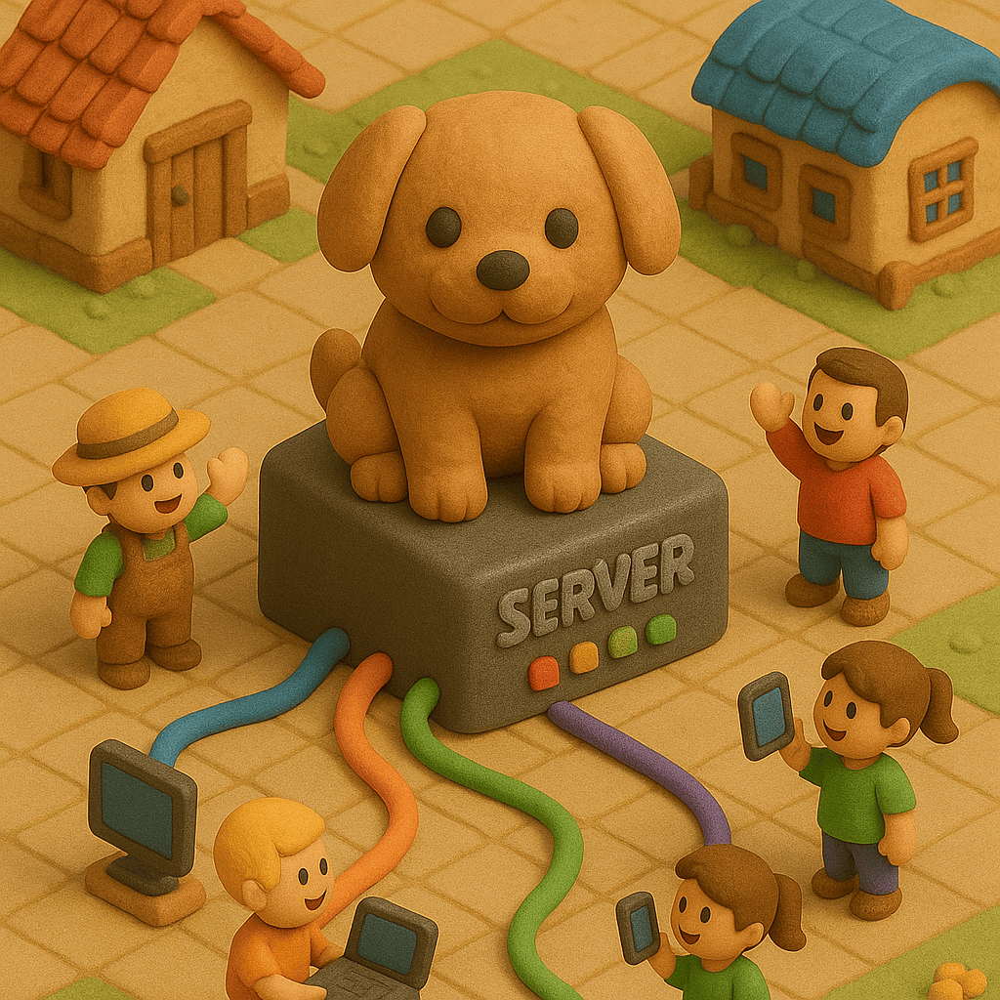
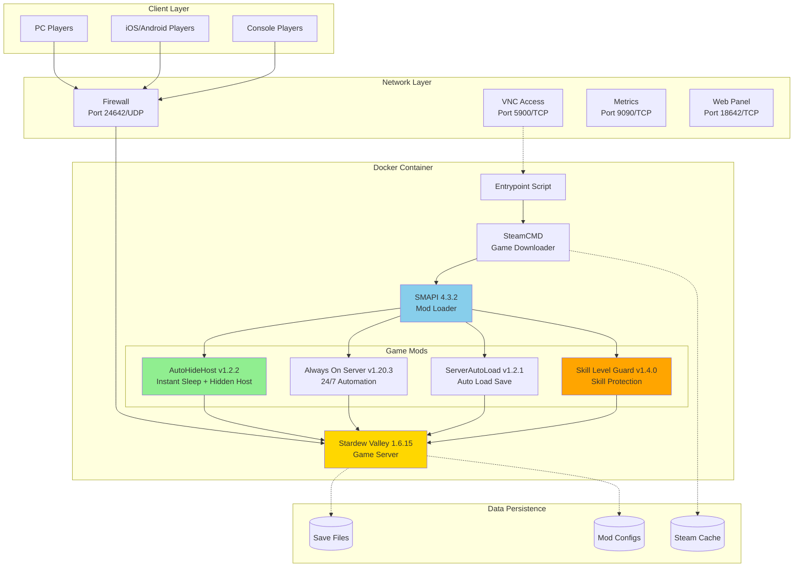
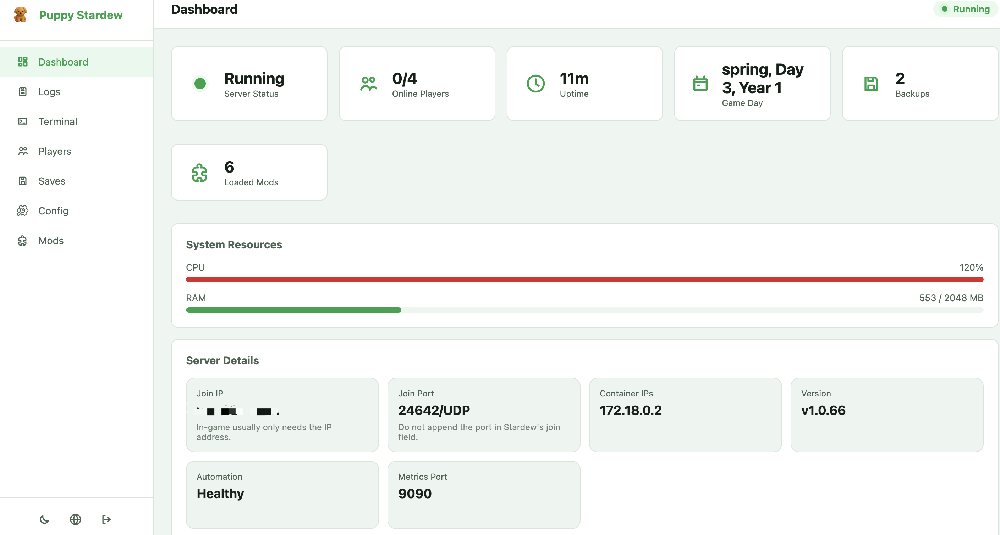
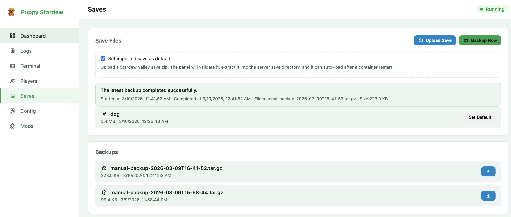

<div align="center">

<table>
<tr>
<td width="30%" align="center">
  
</td>
<td width="70%">

# Puppy Stardew Server
## Dockerized Stardew Valley Multiplayer Server

[](https://hub.docker.com/r/truemanlive/puppy-stardew-server)
[](https://hub.docker.com/r/truemanlive/puppy-stardew-server)
[](https://github.com/AmigaMeow/puppy-stardew-server)
[](LICENSE)

English | [中文](README_CN.md)

**Production-ready deployment, browser-based operations, and persistent save management**

</td>
</tr>
</table>

</div>

---

## Project Status: Feature-Frozen (Best-Effort Maintenance)

> **This project is feature-frozen and maintained on a best-effort basis.** It remains usable and accepts security/compatibility fixes, but no new features are planned.

**What this project is.** A Dockerized, *always-on dedicated host* for Stardew Valley. The container runs the actual game and acts as the multiplayer host. This works well for casual day-to-day play and for keeping a world available 24/7.

**The fundamental limitation you should understand before relying on it.** Stardew Valley has no real "dedicated server" concept — **the host is a full game participant**, not a passive server process. Whenever the game takes control of the host (festivals, non-skippable events, certain cutscenes, forced animations), an unattended headless host can stall, which blocks connected players. The bundled mods paper over the common cases (hiding the host, instant sleep, skipping *skippable* events) but **cannot fully solve this** — see [KNOWN_ISSUES.md](KNOWN_ISSUES.md). In particular, **festivals and non-skippable events are not handled**, and a container restart currently requires a one-time manual save reload to re-init multiplayer.

**Best fit:** hobbyist setups that want a 24/7 persistent world and accept best-effort behavior with occasional manual intervention.

**If your goal is simply "let a few friends play together easily across platforms (PC / Mac / Android / iOS)",** a *human-hosted* game combined with a virtual-LAN / relay layer (so clients join over IP across NAT) is far more robust, because a real human at the host handles festivals and events naturally. That direction avoids the engine limitations above entirely.

---

## Overview

Puppy Stardew Server packages Stardew Valley, SMAPI, and a curated server-oriented mod stack into a Docker-based deployment workflow. The project is designed for operators who want a repeatable multiplayer server setup with persistent data, predictable restart behavior, and a web-based management surface.

It supports both one-command bootstrap and manual Docker Compose deployment. Once installed, the server can be operated through the web panel for save management, log inspection, runtime configuration, backups, and mod workflows.

## Project Architecture

The runtime is organized as a single game container with persistent bind mounts for saves, logs, backups, panel state, and custom mods. The web panel and automation scripts live alongside the game process so operators can manage the server without attaching to the container for routine tasks.



## Core Capabilities

- **One-command bootstrap** for first-time deployment on Docker hosts
- **Manual Compose deployment** for operators who prefer explicit infrastructure control
- **Persistent runtime state** for saves, logs, backups, panel authentication, and uploaded mods
- **Integrated web panel** for status, logs, saves, config changes, and operational actions
- **Automatic save loading** through the bundled server automation stack
- **Headless operation** with optional VNC only when interactive setup is needed
- **Backup and restore workflows** including archive download and uploaded save import
- **Mod management workflows** for custom mod upload, installation, and cleanup
- **Monitoring and recovery hooks** including Prometheus metrics and crash restart controls

<div align="center">


*Included automation allows the server to progress without waiting on a visible host client.*

</div>

## Web Panel Screenshots

### Dashboard



Operational overview with server status, join details, runtime metrics, and health signals.

### Saves and Backups



Save archive upload, default save selection, backup execution, and downloadable restore points.

## Release Highlights

### v1.0.77 (March 2026)

This release focused on closing the gap between a working prototype and an operator-friendly server distribution.

- **First-run panel setup** replaces shared default credentials with an explicit password initialization flow.
- **Theme and UI polish** adds light/dark mode support and improves navigation consistency across login and panel pages.
- **Save management** now includes uploaded save import, default save selection, background backup jobs, and downloadable backup archives.
- **Config workflows** support runtime updates for Steam credentials and container-affecting settings from the web panel.
- **Logs and status reporting** provide better categorization, richer dashboard metadata, improved join IP handling, and more accurate player state reporting.
- **Bootstrap and runtime fixes** clean up quick-start output, reduce headless audio noise, and improve behavior in non-interactive server environments.

## Quick Start

### Watch the One-Command Deployment in Action

[](https://asciinema.org/a/SYBS2qWsb5ZlSolbFPuoA7EJY)

### Option 1: One-Command Deployment (Recommended for Beginners)

**English Version:**

```bash
curl -sSL https://raw.githubusercontent.com/AmigaMeow/puppy-stardew-server/main/quick-start.sh | bash
```

The script will:
- Check your Docker installation
- Guide you to enter Steam credentials
- Create all necessary directories with correct permissions
- Generate configuration files
- Start the server
- Show you connection information

**That's it!** ☕ Grab a coffee while it downloads the game (~1.5GB).

<details>
<summary><h3>Option 2: Manual Setup (For Advanced Users)</h3></summary>

#### Prerequisites

- Docker and Docker Compose installed
  - **Quick install** (Linux): `curl -fsSL https://get.docker.com | sh`
  - **Or follow official guide**: [Get Docker](https://docs.docker.com/get-docker/)
- A Steam account **with Stardew Valley purchased**
- 2GB RAM minimum, 4GB recommended
- 2GB free disk space

#### Step 1: Download Configuration Files

```bash
# Clone the repository
git clone https://github.com/AmigaMeow/puppy-stardew-server.git
cd puppy-stardew-server

# Or download files directly
mkdir puppy-stardew && cd puppy-stardew
wget https://raw.githubusercontent.com/AmigaMeow/puppy-stardew-server/main/docker-compose.yml
wget https://raw.githubusercontent.com/AmigaMeow/puppy-stardew-server/main/.env.example
```

#### Step 2: Configure Environment

```bash
# Copy environment template
cp .env.example .env

# Edit with your Steam credentials
nano .env  # or use your favorite editor
```

**`.env` example:**
```env
STEAM_USERNAME=your_steam_username
STEAM_PASSWORD=your_steam_password
ENABLE_VNC=true
# Leave blank to auto-generate a random password at startup
# (retrieve with: docker exec <container> cat /home/steam/web-panel/data/vnc_password.txt)
VNC_PASSWORD=
```

**Important**: You MUST own Stardew Valley on Steam. Game files are downloaded via your account.

#### Step 3: Initialize Data Directories

**CRITICAL: This step prevents "Disk write failure" errors!**

```bash
# Run the initialization script (Recommended)
./init.sh

# Or manual setup
mkdir -p data/{saves,game,steam,logs,backups,custom-mods}
chown -R 1000:1000 data/
```

#### Step 4: Start the Server

```bash
# Start the server
docker compose up -d

# View logs
docker logs -f puppy-stardew
```

**If Steam Guard is enabled**, you'll need to enter the code:

```bash
docker attach puppy-stardew
# Paste your Steam Guard code and press ENTER
# IMPORTANT: No output will be shown - this is normal!
# Wait a few seconds, game download will start automatically
# Press Ctrl+P Ctrl+Q to detach (NOT Ctrl+C!)
```

</details>

## Initial Setup (First Run Only)

After the server starts, you have **two options** to manage your server:

### Option A: Web Management Panel (Recommended) 🌐

Access the web panel at `http://your-server-ip:18642`

- **First visit**: you'll be prompted to create the admin password in the browser
- **Features**:
  - Real-time server status dashboard
  - Live log streaming with filters
  - Interactive terminal for SMAPI console
  - Player management
  - Save file backup/download
  - Configuration editor
  - Mod management

### Option B: VNC Remote Desktop

1. **Connect to VNC:**
   - Address: `your-server-ip:5900`
   - Password: the `VNC_PASSWORD` from your `.env` file. If you left it blank, a random password is generated at startup — retrieve it with `docker exec <container> cat /home/steam/web-panel/data/vnc_password.txt`
   - VNC Client: [RealVNC](https://www.realvnc.com/en/connect/download/viewer/), [TightVNC](https://www.tightvnc.com/), or any VNC viewer

2. **In the VNC window:**
   - **For NEW farm**: Click "CO-OP" → "Host" → Select "Starting Cabins" (Number of Cabins)
     - **IMPORTANT**: Starting Cabins = Number of players who can join (excluding host)
     - Example: Select "3 Cabins" to allow 3 friends to join (4 players total)
     - If you select "0 Cabins", other players will see "No available slots" error
   - **For EXISTING save**: Click "Load" → Select your save file

3. **Once loaded:**
   - The ServerAutoLoad mod will remember your save
   - Future restarts will auto-load this save
   - Always On Server will automatically enable Auto Mode
   - You can disconnect from VNC

4. **Players can now connect!**
   - Open Stardew Valley
   - Click "Co-op" → "Join LAN Game"
   - Your server should appear in the list automatically
   - Or manually enter your server IP: `192.168.1.100` (example)
   - **Important**:
     - Just enter IP address, **NO port number needed** (not `192.168.1.100:24642`)
     - Port 24642/UDP is used automatically
     - For internet play with port forwarding, forward **UDP** protocol (not TCP)

## What's Inside

### Pre-installed Mods

| Mod | Version | Purpose | Key Features |
|-----|---------|---------|--------------|
| **Always On Server** | v1.20.3 | Keeps server running 24/7 without host player | Headless server operation |
| **AutoHideHost** | v1.2.2 | Custom mod - Hides host player and enables instant sleep | Seamless day-night transitions |
| **ServerAutoLoad** | v1.2.1 | Custom mod - Automatically loads your save on startup | No manual VNC loading needed |
| **✨ Skill Level Guard** | v1.4.0 | **NEW** - Prevents forced Level 10 bug & enables auto-activation | XP-based level calculation + Auto Mode activation |

**What's New in v1.0.58:**
- 🎉 **Fixed**: Always On Server auto-enables correctly after container restart
- ✅ **Added**: Skill Level Guard v1.4.0 with ToggleAutoMode invocation via reflection
- ✅ **Verified**: Game pauses when no players connected
- ✅ **Tested**: ServerAutoLoad and Always On Server work seamlessly together

All mods are pre-configured and ready to use!

## Common Tasks

<details>
<summary><b>View Server Logs</b></summary>

```bash
# Real-time logs
docker logs -f puppy-stardew

# Last 100 lines
docker logs --tail 100 puppy-stardew
```
</details>

<details>
<summary><b>Restart Server</b></summary>

```bash
docker compose restart
```
</details>

<details>
<summary><b>Stop Server</b></summary>

```bash
docker compose down
```
</details>

<details>
<summary><b>Update to Latest Version</b></summary>

```bash
docker compose down
docker pull truemanlive/puppy-stardew-server:latest
docker compose up -d
```
</details>

<details>
<summary><b>Backup Your Saves</b></summary>

```bash
# Manual backup
tar -czf backup-$(date +%Y%m%d).tar.gz data/saves/

# Or use the backup script (after running quick-start.sh)
./backup.sh
```
</details>

<details>
<summary><b>Replace or Upload New Save</b></summary>

You can replace the current save or upload a new one at any time.

### Method 1: Upload Save from Your PC

1. **Locate your save on your PC**:
   - **Windows**: `%AppData%\StardewValley\Saves\YourFarm_123456789\`
   - **Mac**: `~/.config/StardewValley/Saves/YourFarm_123456789/`
   - **Linux**: `~/.config/StardewValley/Saves/YourFarm_123456789/`

2. **Upload to server**:
   ```bash
   # Copy the entire save folder to the server
   scp -r YourFarm_123456789/ root@your-server:/root/puppy-stardew-server/data/saves/Saves/
   ```

3. **Restart container** (it will auto-fix permissions):
   ```bash
   docker compose restart
   ```

4. **Verify**:
   ```bash
   docker logs -f puppy-stardew
   # Look for: "✓ SAVE LOADED SUCCESSFULLY"
   ```

### Method 2: Replace Existing Save

1. **Backup current save** (optional but recommended):
   ```bash
   tar -czf old-save-$(date +%Y%m%d).tar.gz data/saves/
   ```

2. **Remove old save**:
   ```bash
   rm -rf data/saves/Saves/OldFarm_*
   ```

3. **Upload new save** (same as Method 1, step 2-4)

### Important Notes

- **Permissions are auto-fixed**: The container automatically fixes file permissions on startup (v1.0.59+)
- **No manual chown needed**: Just restart the container after uploading
- **Save format**: Must be a co-op save (created via CO-OP menu, not "New" menu)
- **ServerAutoLoad**: Will automatically detect and load the new save

### Troubleshooting

If save doesn't load:
```bash
# Check if save files exist
docker exec puppy-stardew ls -la /home/steam/.config/StardewValley/Saves/

# Check permissions (should be steam:steam or 1000:1000)
docker exec puppy-stardew ls -l /home/steam/.config/StardewValley/Saves/YourFarm_*/

# Force restart to trigger permission fix
docker compose restart
```
</details>

## Troubleshooting

<details>
<summary><b>Error: "Disk write failure" when downloading game</b></summary>

**Cause**: Data directories have wrong permissions.

**Fix** (v1.0.59+):
```bash
# Simply restart the container - it will auto-fix permissions
docker compose restart
```

**Manual fix** (if auto-fix doesn't work):
```bash
chown -R 1000:1000 data/
docker compose restart
```

**Note**: Since v1.0.59, the container automatically fixes file permissions on startup. You only need to restart the container after uploading files.
</details>

<details>
<summary><b>Steam Guard code required</b></summary>

If you have Steam Guard enabled:

```bash
docker attach puppy-stardew
# Paste the code from your email/mobile app and press ENTER
# IMPORTANT: You won't see any output - this is normal!
# Wait a few seconds for game download to start automatically
# Press Ctrl+P Ctrl+Q to detach (NOT Ctrl+C!)
```

**Tip**: Consider using Steam Guard mobile app for faster codes.
</details>

<details>
<summary><b>Game won't start</b></summary>

1. Check logs: `docker logs puppy-stardew`
2. Verify Steam credentials in `.env`
3. Ensure you own Stardew Valley on Steam
4. Check disk space: `df -h`
5. Restart: `docker compose restart`
</details>

<details>
<summary><b>Players can't connect</b></summary>

1. **Check firewall**: Port `24642/udp` must be open
   ```bash
   # Ubuntu/Debian
   sudo ufw allow 24642/udp

   # CentOS/RHEL
   sudo firewall-cmd --add-port=24642/udp --permanent
   sudo firewall-cmd --reload
   ```

2. **Verify server is running**:
   ```bash
   docker ps | grep puppy-stardew
   ```

3. **Check if save is loaded**: Connect via VNC or check logs for "Save loaded"

4. **Ensure game versions match**: Server and clients must have same Stardew Valley version
</details>

<details>
<summary><b>Always On Server not auto-enabling</b></summary>

**Fixed in v1.0.58!**

If you still experience this after updating:

1. **Pull latest image**:
   ```bash
   docker compose down
   docker pull truemanlive/puppy-stardew-server:latest
   docker compose up -d
   ```

2. **Check mod version**:
   ```bash
   docker logs puppy-stardew | grep "Skill Level Guard"
   # Should show v1.4.0
   ```

3. **Verify auto-enable logs**:
   ```bash
   docker logs puppy-stardew | grep "Auto mode on"
   # Should show "Auto mode on!" message
   ```
</details>

## Advanced Configuration

<details>
<summary><b>Crash Auto-Restart</b></summary>

The server automatically restarts the game if it crashes. Restarts are rate-limited to prevent infinite loops.

**Configuration** (via environment variables in `.env`):
```env
ENABLE_CRASH_RESTART=true        # Enable/disable auto-restart (default: true)
CRASH_RESTART_DELAY=10           # Seconds to wait before restarting (default: 10)
CRASH_RESTART_MAX=5              # Max restarts within the cooldown window (default: 5)
CRASH_RESTART_COOLDOWN=3600      # Cooldown window in seconds (default: 3600 = 1 hour)
```

**How it works:**
- If the game process exits unexpectedly, the entrypoint script detects it and restarts
- A maximum of `CRASH_RESTART_MAX` restarts are allowed within `CRASH_RESTART_COOLDOWN` seconds
- If the limit is exceeded, the container stops to prevent restart loops
- Check logs for restart events: `docker logs puppy-stardew | grep "restart"`

</details>

<details>
<summary><b>Prometheus Metrics</b></summary>

Monitor your server health with Prometheus-compatible metrics at `http://your-server:9090/metrics`.

**Enable metrics** (in `.env`):
```env
ENABLE_METRICS=true
METRICS_PORT=9090
```

**Expose the port** (in `docker-compose.yml`):
```yaml
ports:
  - "24642:24642/udp"
  - "5900:5900/tcp"
  - "9090:9090/tcp"   # Prometheus metrics
```

**Available metrics:**
- `stardew_players_online` - Number of connected players
- `stardew_server_uptime_seconds` - Server uptime
- `stardew_crash_restarts_total` - Total crash restarts
- `stardew_save_last_loaded_timestamp` - Last save load time

**Example Prometheus scrape config:**
```yaml
scrape_configs:
  - job_name: 'stardew'
    static_configs:
      - targets: ['your-server:9090']
```

</details>

<details>
<summary><b>Save Selector</b></summary>

Choose which save file to auto-load by setting the `SAVE_NAME` environment variable.

**Configuration** (in `.env`):
```env
SAVE_NAME=MyFarm_123456789
```

**How it works:**
- If `SAVE_NAME` is set, ServerAutoLoad will load that specific save
- If not set, the most recently modified save is loaded (default behavior)
- The save name must match the folder name in `data/saves/Saves/`

**List available saves:**
```bash
ls data/saves/Saves/
# Output: MyFarm_123456789  AnotherFarm_987654321
```

</details>

<details>
<summary><b>Custom Mods</b></summary>

Install your own SMAPI mods by placing them in the `data/custom-mods/` directory.

**Step 1:** Create the custom mods directory (if not already present):
```bash
mkdir -p data/custom-mods
```

**Step 2:** Download and extract your mod into the directory:
```bash
# Example: Install a mod from Nexus Mods
unzip CJBCheatsMenu-1.35.0.zip -d data/custom-mods/
```

**Step 3:** Restart the server:
```bash
docker compose restart
```

**How it works:**
- On startup, the container copies mods from `data/custom-mods/` into the SMAPI Mods folder
- Mods persist across container recreations via the volume mount
- Each mod should be in its own subfolder with a `manifest.json`

**Directory structure:**
```
data/custom-mods/
├── CJBCheatsMenu/
│   ├── manifest.json
│   └── CJBCheatsMenu.dll
└── ChatCommands/
    ├── manifest.json
    └── ChatCommands.dll
```

</details>

<details>
<summary><b>Player Access Control</b></summary>

Restrict who can join your server using a whitelist or blacklist.

**Configuration** (in `.env`):
```env
PLAYER_ACCESS_MODE=whitelist      # "whitelist", "blacklist", or "open" (default: open)
PLAYER_ACCESS_FILE=data/player-access.json
```

**Whitelist example** (`data/player-access.json`):
```json
{
  "mode": "whitelist",
  "players": [
    { "name": "FarmerJane", "note": "My friend" },
    { "name": "FarmerBob", "note": "Brother" }
  ]
}
```

**Blacklist example** (`data/player-access.json`):
```json
{
  "mode": "blacklist",
  "players": [
    { "name": "Griefer123", "note": "Destroyed crops" }
  ]
}
```

**How it works:**
- **whitelist** mode: Only listed players can join
- **blacklist** mode: Listed players are blocked from joining
- **open** mode: Anyone can join (default)
- Changes take effect on server restart

</details>

<details>
<summary><b>Docker Secrets</b></summary>

Use Docker Secrets for secure credential storage instead of plain-text `.env` files.

**Step 1:** Create secret files:
```bash
echo "your_steam_username" | docker secret create steam_username -
echo "your_steam_password" | docker secret create steam_password -
echo "your_vnc_password" | docker secret create vnc_password -
```

**Step 2:** Update `docker-compose.yml`:
```yaml
services:
  stardew:
    image: truemanlive/puppy-stardew-server:latest
    secrets:
      - steam_username
      - steam_password
      - vnc_password
    environment:
      - STEAM_USERNAME_FILE=/run/secrets/steam_username
      - STEAM_PASSWORD_FILE=/run/secrets/steam_password
      - VNC_PASSWORD_FILE=/run/secrets/vnc_password

secrets:
  steam_username:
    external: true
  steam_password:
    external: true
  vnc_password:
    external: true
```

**How it works:**
- Secrets are mounted as files at `/run/secrets/<name>` inside the container
- The entrypoint script reads `*_FILE` environment variables and loads values from those files
- Secrets are never exposed in `docker inspect` or process listings
- **Note:** Docker Secrets require Docker Swarm mode (`docker swarm init`)

**Alternative for Docker Compose (non-Swarm):**
```yaml
secrets:
  steam_username:
    file: ./secrets/steam_username.txt
  steam_password:
    file: ./secrets/steam_password.txt
```

</details>

<details>
<summary><b>Customize Mod Settings</b></summary>

Mod configs are in `/home/steam/stardewvalley/Mods/` inside the container:

```bash
# Edit AutoHideHost config
docker exec puppy-stardew nano /home/steam/stardewvalley/Mods/AutoHideHost/config.json

# Edit Always On Server config
docker exec puppy-stardew nano /home/steam/stardewvalley/Mods/AlwaysOnServer/config.json

# Edit ServerAutoLoad config
docker exec puppy-stardew nano /home/steam/stardewvalley/Mods/ServerAutoLoad/config.json
```

After editing, restart the server:
```bash
docker compose restart
```
</details>

<details>
<summary><b>Change Port Numbers</b></summary>

Edit `docker-compose.yml`:

```yaml
ports:
  - "24642:24642/udp"  # Change first number to your desired port
  - "5900:5900/tcp"    # VNC port
```

Restart after changes:
```bash
docker compose up -d
```
</details>

<details>
<summary><b>Disable VNC After Setup</b></summary>

Edit `.env`:
```env
ENABLE_VNC=false
```

Restart:
```bash
docker compose up -d
```

This saves ~50MB RAM.
</details>

## System Requirements

**Server:**
- **CPU**: 1+ cores (2+ recommended for 4+ players)
- **RAM**: 2GB minimum (4GB recommended for 4+ players)
- **Disk**: 2GB free space
- **OS**: Linux, Windows (Docker Desktop), macOS (Docker Desktop)
- **Network**: Open port 24642/UDP (and 5900/TCP for VNC)

**Clients:**
- Stardew Valley (any platform: PC, Mac, Linux, iOS, Android)
- Same game version as server (1.6.15)
- LAN or internet connection to server

## License & Legal

**License**: MIT License - free to use, modify, and distribute.

**Important Legal Notes:**
- You MUST own Stardew Valley on Steam
- Game files are downloaded via YOUR Steam account
- This is NOT a piracy tool
- Mods follow their original licenses:
  - Always On Server: [GPL-3.0](https://github.com/funny-snek/Always-On-Server-for-Multiplayer)
  - ServerAutoLoad: MIT (custom mod for this project)
  - AutoHideHost: MIT (custom mod for this project)
  - Skill Level Guard: MIT (custom mod for this project)

## Credits

- **Stardew Valley** by [ConcernedApe](https://www.stardewvalley.net/)
- **SMAPI** by [Pathoschild](https://smapi.io/)
- **Always On Server** by funny-snek & Zuberii
- **Docker** by Docker, Inc.

## Contributing

Contributions are welcome! Please:

1. Fork the repository
2. Create a feature branch
3. Submit a pull request

## Support & Community

- **Bug Reports**: [GitHub Issues](https://github.com/AmigaMeow/puppy-stardew-server/issues)
- **Questions**: [GitHub Discussions](https://github.com/AmigaMeow/puppy-stardew-server/discussions)
- **Docker Hub**: [truemanlive/puppy-stardew-server](https://hub.docker.com/r/truemanlive/puppy-stardew-server)

## Star History

If this project helps you, consider giving it a star! ⭐

---

<div align="center">


</div>
