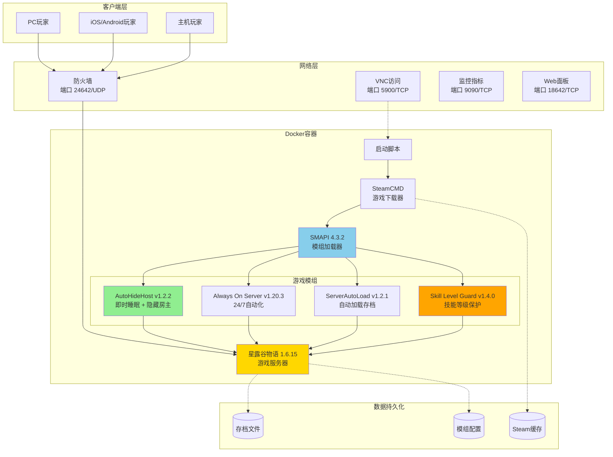
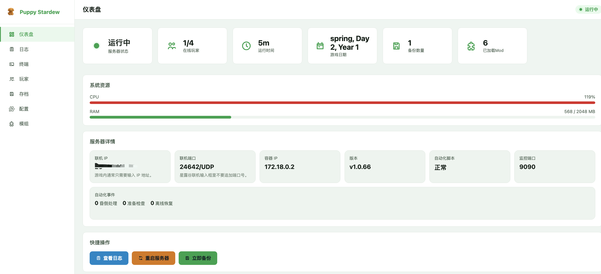
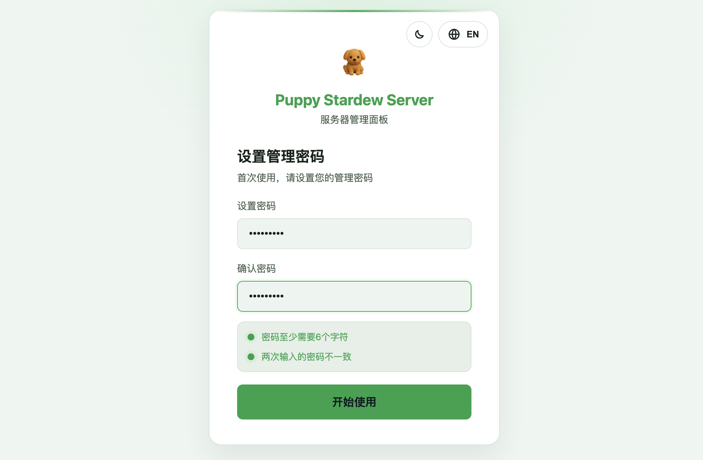

<div align="center">

<table>
<tr>
<td width="30%" align="center">
  
</td>
<td width="70%">

# Puppy Stardew Server
## Docker 化的星露谷物语联机服务器

[](https://hub.docker.com/r/truemanlive/puppy-stardew-server)
[](https://hub.docker.com/r/truemanlive/puppy-stardew-server)
[](https://github.com/AmigaMeow/puppy-stardew-server)
[](LICENSE)

[English](README.md) | 中文

**面向部署与运维的 Web 面板、持久化存档与自动化联机方案**

</td>
</tr>
</table>

</div>

---

## 项目状态：功能冻结（best-effort 维护）

> **本项目已功能冻结，仅按 best-effort 维护。** 仍可继续使用，也会接受安全/兼容性修复，但不再规划新功能。

**这个项目是什么。** 一个 Docker 化的、**24/7 常驻的星露谷专用房主**。容器内运行真实游戏并充当联机房主，适合日常休闲联机以及让世界 24 小时保持在线。

**在依赖它之前，你必须理解的根本局限。** 星露谷没有真正的"专用服务器"概念——**房主是一个完整的游戏参与者**，而不是一个被动的服务器进程。每当游戏夺走房主的控制权（节日、不可跳过的事件、某些过场动画、强制动画）时，一个无人值守的无头房主就可能卡住，进而导致已连接的玩家也无法操作。捆绑的模组只能缓解常见情况（隐藏房主、即时睡眠、跳过*可跳过*的事件），但**无法彻底解决**——详见 [KNOWN_ISSUES.md](KNOWN_ISSUES.md)。其中，**节日和不可跳过的事件完全没有被处理**，且容器重启后目前需要手动重新加载一次存档才能重新初始化联机。

**最适合的场景：** 想要一个 24/7 持久世界、并能接受 best-effort 表现（偶尔需要人工介入）的爱好者部署。

**如果你的目标只是"让几个朋友跨平台（PC / Mac / 安卓 / iOS）轻松一起玩"，** 那么"**真人当房主** + 虚拟局域网/中转层（让客户端通过 IP 穿过 NAT 加入）"的方案要稳健得多——因为房主端有真人，节日和事件都能自然处理，从而完全绕开上面这些引擎层面的局限。

---

## 项目概述

Puppy Stardew Server 将 Stardew Valley、SMAPI 和一组面向服务器运行场景的模组整合到 Docker 部署流程中，目标是提供一个可重复部署、可持久化、可运维的联机服务器方案。

项目同时支持一键脚本和手动 Docker Compose 部署。部署完成后，日常操作可以尽量通过 Web 面板完成，包括状态查看、日志筛选、存档管理、备份恢复、配置修改以及模组处理，而不是反复进入容器手工排查。

## 项目架构

运行时以单个游戏容器为核心，配合持久化目录保存存档、日志、备份、面板状态和自定义模组。Web 面板与自动化脚本和游戏进程协同工作，用于降低服务器部署后的维护成本。



## 核心能力

- **一键部署入口**，适合首次在 Docker 主机上快速拉起服务
- **手动 Compose 部署**，适合希望显式控制环境变量和挂载目录的用户
- **运行时数据持久化**，覆盖存档、日志、备份、面板认证和自定义模组
- **集成式 Web 面板**，用于状态查看、日志筛选、存档管理、配置变更和常见运维操作
- **自动存档加载链路**，在容器重启后恢复指定存档
- **无头运行模式**，仅在需要首次交互时启用可选 VNC
- **备份与恢复流程**，支持备份下载、存档上传和默认存档切换
- **模组管理流程**，支持自定义模组上传、安装和删除
- **监控与恢复能力**，包含 Prometheus 指标和崩溃恢复控制

<div align="center">


*自动化模组可以让服务器在无可见房主的情况下继续推进游戏流程。*

</div>

## Web 管理面板截图

### 仪表盘



提供服务器状态、联机信息、运行指标和关键健康信号的集中视图。

### 登录页面



首次访问可直接初始化管理密码，后续用于统一入口认证。

## 版本更新摘要

### v1.0.77 (2026年3月)

这一版的重点是把项目从“能运行”进一步整理成“更适合长期运维”的服务器分发形态。

- **首次访问初始化**：Web 面板改为首次访问设置管理密码，不再依赖共享默认口令。
- **界面与交互改进**：补齐亮色和暗色主题，统一登录页与主面板的交互体验。
- **存档流程补强**：支持存档上传、默认存档选择、后台备份任务以及备份包下载。
- **配置链路完善**：面板内可安全更新 Steam 凭证，并对需要重建容器的配置提供更明确的处理路径。
- **日志与状态修复**：改进分类日志、联机地址展示、在线人数统计和仪表盘运行状态。
- **启动与运行环境修复**：清理一键脚本文案，完善无头音频默认配置，降低纯 Docker 环境中的噪声和误导信息。

## 快速开始

### 观看一键部署演示

[](https://asciinema.org/a/SYBS2qWsb5ZlSolbFPuoA7EJY)

### 方式 1：一键部署（推荐首次使用）

**中文版（官方）:**

```bash
curl -sSL https://raw.githubusercontent.com/AmigaMeow/puppy-stardew-server/main/quick-start-zh.sh | bash
```

**中文版（国内加速）:**

如果上面的命令访问失败，可以使用以下加速服务：

```bash
# 加速方案 1: jsDelivr CDN（推荐）
curl -sSL https://cdn.jsdelivr.net/gh/AmigaMeow/puppy-stardew-server@main/quick-start-zh.sh | bash

# 加速方案 2: Statically CDN
curl -sSL https://cdn.statically.io/gh/AmigaMeow/puppy-stardew-server/main/quick-start-zh.sh | bash

# 加速方案 3: GitHack
curl -sSL https://raw.githack.com/AmigaMeow/puppy-stardew-server/main/quick-start-zh.sh | bash
```

**⚠️ 如果所有加速方案都无法访问**，请使用**方式 2：手动部署**（见下方），步骤同样简单，且**完全不需要访问 GitHub**。

脚本会自动：
- 检查 Docker 安装
- 引导输入 Steam 凭证
- 创建必要目录并设置正确权限
- 生成配置文件
- 启动服务器
- 显示连接信息

**就这么简单！** ☕ 下载游戏文件时去喝杯咖啡（约 1.5GB）。

<details>
<summary><h3>方式 2：手动部署（国内网络友好）</h3></summary>

#### 前置要求

- 已安装 Docker 和 Docker Compose
  - **快速安装**（Linux）：`curl -fsSL https://get.docker.com | sh`
  - **或参考官方指南**：[安装 Docker](https://docs.docker.com/get-docker/)
- 一个 Steam 账户，**并且已购买星露谷物语**
- 最低 2GB 内存，推荐 4GB
- 2GB 可用磁盘空间

#### 步骤 1：创建工作目录和配置文件（无需访问 GitHub）

```bash
# 创建工作目录
mkdir -p ~/puppy-stardew && cd ~/puppy-stardew

# 直接创建 docker-compose.yml（使用 Docker Hub 镜像）
cat > docker-compose.yml << 'EOF'
version: '3.8'
services:
  stardew-server:
    image: truemanlive/puppy-stardew-server:latest
    container_name: puppy-stardew
    restart: unless-stopped
    stdin_open: true
    tty: true
    environment:
      - STEAM_USERNAME=${STEAM_USERNAME}
      - STEAM_PASSWORD=${STEAM_PASSWORD}
      - ENABLE_VNC=${ENABLE_VNC:-true}
      # 留空则启动时自动生成随机密码（写入容器内 web-panel/data/vnc_password.txt）
      - VNC_PASSWORD=${VNC_PASSWORD:-}
    ports:
      - "24642:24642/udp"
      - "5900:5900/tcp"
      - "18642:18642/tcp"
    volumes:
      - ./data/saves:/home/steam/.config/StardewValley:rw
      - ./data/game:/home/steam/stardewvalley:rw
      - ./data/steam:/home/steam/Steam:rw
      - ./data/logs:/home/steam/.local/share/puppy-stardew/logs:rw
      - ./data/backups:/home/steam/.local/share/puppy-stardew/backups:rw
      - ./data/panel:/home/steam/web-panel/data:rw
      - ./data/custom-mods:/home/steam/custom-mods:rw
    deploy:
      resources:
        limits:
          cpus: '2.0'
          memory: 2G
        reservations:
          memory: 1G
EOF

# 创建 .env 配置文件
cat > .env << 'EOF'
# Steam 账户信息（必填 - 请修改为您的真实账号）
STEAM_USERNAME=your_steam_username
STEAM_PASSWORD=your_steam_password

# VNC 配置（可选）
ENABLE_VNC=true
# 留空则启动时自动生成随机密码
# （用 docker exec <容器> cat /home/steam/web-panel/data/vnc_password.txt 读取）
VNC_PASSWORD=
EOF
```

#### 步骤 2：编辑配置文件，填入您的 Steam 凭证

```bash
# 使用文本编辑器修改 .env 文件
nano .env  # 或使用 vi、vim 等编辑器
```

**重要**：您必须在 Steam 上拥有星露谷物语。游戏文件通过您的账户下载。

#### 步骤 3：初始化数据目录

```bash
# 创建数据目录并设置正确权限
mkdir -p data/{saves,game,steam,logs,backups,panel,custom-mods}
chown -R 1000:1000 data/
```

**⚠️ 此步骤很重要！** 权限设置不正确会导致 "Disk write failure" 错误。从 v1.0.59+ 版本开始，容器会自动修复权限，但首次创建目录时仍需正确设置。

#### 步骤 4：启动服务器

```bash
# 启动服务器
docker compose up -d

# 查看日志
docker logs -f puppy-stardew
```

**如果启用了 Steam 令牌**，您需要输入验证码：

```bash
docker attach puppy-stardew
# 粘贴您的 Steam 令牌代码并按回车
# 重要：不会显示任何内容 - 这是正常的！
# 等待几秒钟，游戏会自动开始下载
# 按 Ctrl+P Ctrl+Q 分离（不是 Ctrl+C！）
```

</details>

## 初始设置（仅首次运行）

服务器启动后，您有**两种方式**管理服务器：

### 方式 A：Web 管理面板（推荐）🌐

访问 Web 面板：`http://服务器IP:18642`

- **首次访问**：浏览器会提示您创建管理密码
- **功能特性**：
  - 实时服务器状态仪表盘
  - 实时日志流与过滤器
  - SMAPI 控制台交互终端
  - 玩家管理
  - 存档备份/下载
  - 配置编辑器
  - 模组管理

### 方式 B：VNC 远程桌面

1. **连接到 VNC：**
   - 地址：`服务器IP:5900`
   - 密码：您在 `.env` 文件中设置的 `VNC_PASSWORD`；若留空，则启动时自动生成随机密码，用 `docker exec <容器> cat /home/steam/web-panel/data/vnc_password.txt` 读取
   - VNC 客户端：[RealVNC](https://www.realvnc.com/en/connect/download/viewer/)、[TightVNC](https://www.tightvnc.com/) 或任何 VNC 查看器

2. **在 VNC 窗口中：**
   - **创建新农场**：点击"合作"→"主机"→ 选择"起始小屋数量"
     - **重要**：起始小屋数量 = 可以加入的玩家数量（不包括主机）
     - 例如：选择"3个小屋"允许3个朋友加入（总共4名玩家）
     - 如果选择"0个小屋"，其他玩家会看到"没有空闲位置"错误
   - **加载现有存档**：点击"加载"→ 选择您的存档文件

3. **加载完成后：**
   - ServerAutoLoad 模组会记住您的存档
   - 以后重启会自动加载此存档
   - Always On Server 会自动启用 Auto Mode
   - 您可以断开 VNC 连接了

4. **玩家现在可以连接了！**
   - 打开星露谷物语
   - 点击"合作" → "加入局域网游戏"
   - 服务器会自动出现在列表中
   - 或手动输入服务器IP：`192.168.1.100`（示例）
   - **重要说明**：
     - 只需输入IP地址，**不需要加端口号**（不是`192.168.1.100:24642`）
     - 自动使用24642/UDP端口
     - 如需内网穿透或端口转发，必须转发**UDP协议**（不是TCP）

## 包含内容

### 预装模组

| 模组 | 版本 | 用途 | 主要功能 |
|-----|------|------|--------|
| **Always On Server** | v1.20.3 | 保持服务器 24/7 运行，不需要房主在线 | 无人值守服务器运行 |
| **AutoHideHost** | v1.2.2 | 自定义模组 - 隐藏房主玩家并启用即时睡眠 | 无缝昼夜过渡 |
| **ServerAutoLoad** | v1.2.1 | 自定义模组 - 启动时自动加载存档 | 无需手动VNC加载 |
| **✨ Skill Level Guard** | v1.4.0 | **新版** - 防止Always On Server强制升到10级并实现自动启用 | 基于经验值精确计算等级 + Auto Mode自动启用 |

**v1.0.66 新功能：**
- 🔄 **崩溃自动重启**：游戏进程意外退出后自动恢复
- 📊 **实时监控**：Prometheus 指标端点，支持 Grafana 仪表板
- 🔧 **自定义模组**：通过 `data/custom-mods/` 安装任意 SMAPI 模组
- 🔐 **安全凭证**：支持 Docker Secrets 替代明文密码

所有模组都已预配置，开箱即用！

## 常用操作

<details>
<summary><b>查看服务器日志</b></summary>

```bash
# 实时日志
docker logs -f puppy-stardew

# 最后 100 行
docker logs --tail 100 puppy-stardew
```
</details>

<details>
<summary><b>重启服务器</b></summary>

```bash
docker compose restart
```
</details>

<details>
<summary><b>停止服务器</b></summary>

```bash
docker compose down
```
</details>

<details>
<summary><b>更新到最新版本</b></summary>

```bash
docker compose down
docker pull truemanlive/puppy-stardew-server:latest
docker compose up -d
```
</details>

<details>
<summary><b>备份存档</b></summary>

```bash
# 手动备份
tar -czf backup-$(date +%Y%m%d).tar.gz data/saves/

# 或使用备份脚本（运行 quick-start.sh 后可用）
./backup.sh
```
</details>

<details>
<summary><b>更换或上传新存档</b></summary>

您可以随时更换当前存档或上传新存档。

### 方法 1：从本机上传存档

1. **在本机找到存档位置**：
   - **Windows**: `%AppData%\StardewValley\Saves\你的农场_123456789\`
   - **Mac**: `~/.config/StardewValley/Saves/你的农场_123456789/`
   - **Linux**: `~/.config/StardewValley/Saves/你的农场_123456789/`

2. **上传到服务器**：
   ```bash
   # 将整个存档文件夹复制到服务器
   scp -r 你的农场_123456789/ root@服务器IP:/root/puppy-stardew-server/data/saves/Saves/
   ```

3. **重启容器**（会自动修复权限）：
   ```bash
   docker compose restart
   ```

4. **验证加载**：
   ```bash
   docker logs -f puppy-stardew
   # 查找："✓ SAVE LOADED SUCCESSFULLY"
   ```

### 方法 2：替换现有存档

1. **备份当前存档**（可选但推荐）：
   ```bash
   tar -czf old-save-$(date +%Y%m%d).tar.gz data/saves/
   ```

2. **删除旧存档**：
   ```bash
   rm -rf data/saves/Saves/旧农场_*
   ```

3. **上传新存档**（同方法 1 的步骤 2-4）

### 重要提示

- **权限自动修复**：容器启动时会自动修复文件权限（v1.0.59+）
- **无需手动 chown**：上传文件后只需重启容器即可
- **存档格式**：必须是多人存档（通过 CO-OP 菜单创建，而非"新游戏"）
- **ServerAutoLoad**：会自动检测并加载新存档

### 故障排除

如果存档没有加载：
```bash
# 检查存档文件是否存在
docker exec puppy-stardew ls -la /home/steam/.config/StardewValley/Saves/

# 检查权限（应该是 steam:steam 或 1000:1000）
docker exec puppy-stardew ls -l /home/steam/.config/StardewValley/Saves/你的农场_*/

# 强制重启以触发权限修复
docker compose restart
```
</details>

## 故障排除

<details>
<summary><b>错误："Disk write failure" 下载游戏时</b></summary>

**原因**：数据目录权限不正确。

**解决方法**（v1.0.59+）：
```bash
# 只需重启容器 - 会自动修复权限
docker compose restart
```

**手动修复**（如果自动修复不起作用）：
```bash
chown -R 1000:1000 data/
docker compose restart
```

**注意**：从 v1.0.59 开始，容器启动时会自动修复文件权限。上传文件后只需重启容器即可。
</details>

<details>
<summary><b>需要 Steam 令牌代码</b></summary>

如果您启用了 Steam 令牌：

```bash
docker attach puppy-stardew
# 粘贴您邮箱/手机应用中的代码并按回车
# 重要：不会显示任何输出 - 这是正常的！
# 等待几秒钟，游戏会自动开始下载
# 按 Ctrl+P Ctrl+Q 分离（不是 Ctrl+C！）
```

**提示**：建议使用 Steam 令牌手机应用，获取代码更快。
</details>

<details>
<summary><b>游戏无法启动</b></summary>

1. 检查日志：`docker logs puppy-stardew`
2. 验证 `.env` 中的 Steam 凭证
3. 确保您在 Steam 上拥有星露谷物语
4. 检查磁盘空间：`df -h`
5. 重启：`docker compose restart`
</details>

<details>
<summary><b>玩家无法连接</b></summary>

1. **检查防火墙**：端口 `24642/udp` 必须开放
   ```bash
   # Ubuntu/Debian
   sudo ufw allow 24642/udp

   # CentOS/RHEL
   sudo firewall-cmd --add-port=24642/udp --permanent
   sudo firewall-cmd --reload
   ```

2. **验证服务器正在运行**：
   ```bash
   docker ps | grep puppy-stardew
   ```

3. **检查存档是否已加载**：通过 VNC 连接或检查日志中的 "Save loaded"

4. **确保游戏版本匹配**：服务器和客户端必须是相同的星露谷物语版本
</details>

<details>
<summary><b>Always On Server 未自动启用</b></summary>

**v1.0.58 已修复此问题！**

如果更新后仍然出现：

1. **拉取最新镜像**：
   ```bash
   docker compose down
   docker pull truemanlive/puppy-stardew-server:latest
   docker compose up -d
   ```

2. **检查模组版本**：
   ```bash
   docker logs puppy-stardew | grep "Skill Level Guard"
   # 应该显示 v1.4.0
   ```

3. **查看启用日志**：
   ```bash
   docker logs puppy-stardew | grep "Auto mode on"
   # 应该显示 "Auto mode on!" 消息
   ```
</details>

## 高级配置

<details>
<summary><b>崩溃自动重启</b></summary>

游戏崩溃时自动重启，限制 5 分钟内最多重启 5 次，防止无限循环。

在 `.env` 中添加：
```env
ENABLE_CRASH_RESTART=true
MAX_CRASH_RESTARTS=5
```

重启后生效：
```bash
docker compose down && docker compose up -d
```
</details>

<details>
<summary><b>Prometheus 监控指标</b></summary>

服务器自动在端口 9090 暴露 Prometheus 格式的指标：

```bash
# 查看指标
curl http://localhost:9090/metrics
```

**可用指标：**
| 指标名 | 说明 |
|--------|------|
| `puppy_stardew_game_running` | 游戏进程是否运行 (1/0) |
| `puppy_stardew_players_online` | 在线玩家数 |
| `puppy_stardew_uptime_seconds` | 运行时间（秒） |
| `puppy_stardew_memory_usage_mb` | 内存使用（MB） |
| `puppy_stardew_cpu_usage_percent` | CPU 使用率 |
| `puppy_stardew_events_passout_total` | 晕倒事件次数 |

自定义端口：在 `.env` 中设置 `METRICS_PORT=8080`
</details>

<details>
<summary><b>存档选择器</b></summary>

指定自动加载哪个存档：

```env
SAVE_NAME=MyFarm_123456789
```

查看可用存档：
```bash
docker exec puppy-stardew ls /home/steam/.config/StardewValley/Saves/
```
</details>

<details>
<summary><b>安装自定义模组</b></summary>

将模组放入 `data/custom-mods/` 目录，重启容器后自动安装。

```bash
# 支持两种格式：
# 1. 模组目录
cp -r MyCustomMod/ data/custom-mods/

# 2. ZIP 压缩包
cp MyMod.zip data/custom-mods/
```

重启生效：
```bash
docker compose restart
```

> 注意：自定义模组目录以只读方式挂载，原始文件不会被修改。
</details>

<details>
<summary><b>玩家访问控制（白名单/黑名单）</b></summary>

在存档目录创建配置文件 `data/saves/player-access.conf`：

**白名单模式**（只允许列表中的玩家）：
```
MODE=whitelist
Alice
Bob
Charlie
```

**黑名单模式**（禁止列表中的玩家）：
```
MODE=blacklist
Griefer123
BadPlayer
```

**禁用**（默认，允许所有人）：
```
MODE=disabled
```

重启后生效。
</details>

<details>
<summary><b>Docker Secrets（安全凭证存储）</b></summary>

替代明文 `.env` 文件，更安全地存储 Steam 凭证：

```bash
# 1. 创建密钥文件
mkdir -p secrets
echo "your_username" > secrets/steam_username.txt
echo "your_password" > secrets/steam_password.txt
chmod 600 secrets/*.txt

# 2. 在 docker-compose.yml 中启用 secrets 部分
# 详见 docker-compose.yml 底部的注释说明

# 3. 从 environment 中移除 STEAM_USERNAME 和 STEAM_PASSWORD
```

容器会自动从 `/run/secrets/` 读取凭证。
</details>

<details>
<summary><b>自定义模组设置</b></summary>

模组配置文件在容器内的 `/home/steam/stardewvalley/Mods/` 目录：

```bash
# 编辑 AutoHideHost 配置
docker exec puppy-stardew nano /home/steam/stardewvalley/Mods/AutoHideHost/config.json

# 编辑 Always On Server 配置
docker exec puppy-stardew nano /home/steam/stardewvalley/Mods/AlwaysOnServer/config.json

# 编辑 ServerAutoLoad 配置
docker exec puppy-stardew nano /home/steam/stardewvalley/Mods/ServerAutoLoad/config.json
```

编辑后重启服务器：
```bash
docker compose restart
```
</details>

<details>
<summary><b>更改端口号</b></summary>

编辑 `docker-compose.yml`：

```yaml
ports:
  - "24642:24642/udp"  # 更改第一个数字为您想要的端口
  - "5900:5900/tcp"    # VNC 端口
```

更改后重启：
```bash
docker compose up -d
```
</details>

<details>
<summary><b>设置完成后禁用 VNC</b></summary>

编辑 `.env`：
```env
ENABLE_VNC=false
```

重启：
```bash
docker compose up -d
```

这可以节省约 50MB 内存。
</details>

## 系统要求

**服务器：**
- **CPU**：1+ 核心（4+ 玩家推荐 2+）
- **内存**：最低 2GB（4+ 玩家推荐 4GB）
- **磁盘**：2GB 可用空间
- **操作系统**：Linux、Windows（Docker Desktop）、macOS（Docker Desktop）
- **网络**：开放端口 24642/UDP（VNC 需要 5900/TCP）

**客户端：**
- 星露谷物语（任何平台：PC、Mac、Linux、iOS、Android）
- 与服务器相同的游戏版本（1.6.15）
- 局域网或互联网连接到服务器

## 许可证与法律

**许可证**：MIT 许可证 - 免费使用、修改和分发。

**重要法律说明：**
- 您必须在 Steam 上拥有星露谷物语
- 游戏文件通过您的 Steam 账户下载
- 这不是盗版工具
- 模组遵循其原始许可证：
  - Always On Server：[GPL-3.0](https://github.com/funny-snek/Always-On-Server-for-Multiplayer)
  - ServerAutoLoad：MIT（本项目自定义模组）
  - AutoHideHost：MIT（本项目自定义模组）
  - Skill Level Guard：MIT（本项目自定义模组）

## 致谢

- **星露谷物语** by [ConcernedApe](https://www.stardewvalley.net/)
- **SMAPI** by [Pathoschild](https://smapi.io/)
- **Always On Server** by funny-snek & Zuberii
- **Docker** by Docker, Inc.

## 贡献

欢迎贡献！请：

1. Fork 本仓库
2. 创建功能分支
3. 提交 Pull Request

## 支持与社区

- **错误报告**：[GitHub Issues](https://github.com/AmigaMeow/puppy-stardew-server/issues)
- **问题讨论**：[GitHub Discussions](https://github.com/AmigaMeow/puppy-stardew-server/discussions)
- **Docker Hub**：[truemanlive/puppy-stardew-server](https://hub.docker.com/r/truemanlive/puppy-stardew-server)

## Star 历史

如果这个项目帮助了您，请考虑给个 Star！⭐

---

<div align="center">

**为星露谷物语社区用爱制作**


</div>
